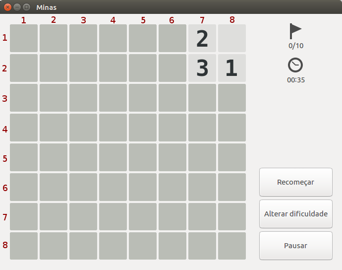

# UFBA AI Minesweeper
Este repositório contém todos os códigos do trabalho final de Gabriel Dahia e Pedro Vidal para a disciplina MATA64 - Inteligência Artificial da Universidade Federal da Bahia.

Para este trabalho, implementamos nossa versão do jogo campo minado e um programa que permite que um agente especificado pelo usuário jogue o jogo. Atualmente, os únicos agentes implementados são a interação com o próprio usuário e um agente lógico.

# Requisitos
* Python 3.5+ (o código é supostamente compatível com Python 2.7+, mas não foi devidamente testado);
* NumPy 1.13.0+;
* `future`, `six` (para compatibilidade com Python 2);
* [Opcional] Tkinter (necessário para jogar com interface gráfica);
* [Opcional] `signal` (com suporte a `signal.alarm`), `json` (ambos necessários para script de validação);
* [Opcional] Matplotlib (necessário para plotar os gráficos).

# Utilização
Para jogar, é necessário executar o código `play.py`:
```
 play.py [-h] [--rows ROWS] [--cols COLS] [--n_bombs N_BOMBS]
               [--seed SEED] --player_type PLAYER_TYPE [--heuristic HEURISTIC]
               [--gui GUI]

optional arguments:
  -h, --help            show this help message and exit
  --rows ROWS           Numero de linhas do campo.
  --cols COLS           Numero de colunas do campo.
  --n_bombs N_BOMBS     Numero de bombas no campo.
  --seed SEED           Semente aleatoria.
  --player_type PLAYER_TYPE
                        Tipo de jogador.
  --heuristic HEURISTIC
                        Heuristica a ser utilizada.
  --gui GUI             Habilita interface grafica
```
Os tipos de jogador implementado são `user` (interação com o próprio usuário) e `logical` (o agente lógico). A única heurística implementada é `model_counting` para o agente lógico.
Explicação mais clara pode ser encontrada no código fonte.

# Agente Lógico
O agente lógico, implementado em `players/logical.py`, utiliza uma abordagem procedural, transformando implicitamente a configuração atual do tabuleiro em uma fórmula de lógica proposicional e avaliando todos os seus modelos com uma tabela verdade.

Cada célula tem um símbolo proposicional - a célula _(i, j)_ tem símbolo _p_<sub>ij</sub> - e cada célula aberta em uma borda determina uma subfórmula da fórmula dessa jogada na forma normal disjuntiva.
O símbolo _p_<sub>ij</sub> equivale a afirmação "a célula _(i, j)_ possui uma mina".

Por exemplo, para o tabuleiro abaixo (imagem retirada do GNOME _Mines_):



Teríamos a seguinte fórmula:
_((p<sub>16</sub> ∧ p<sub>26</sub>)) ∧ ((p<sub>16</sub> ∧ p<sub>26</sub> ∧ p<sub>36</sub> ∧ ¬p<sub>37</sub> ∧ ¬p<sub>38</sub>) ∨ (p<sub>16</sub> ∧ p<sub>26</sub> ∧ ¬p<sub>36</sub> ∧ p<sub>37</sub> ∧ ¬p<sub>38</sub>) ∨ (p<sub>16</sub> ∧ p<sub>26</sub> ∧ ¬p<sub>36</sub> ∧ ¬p<sub>37</sub> ∧ p<sub>38</sub>) ∨ (p<sub>16</sub> ∧ ¬p<sub>26</sub> ∧ p<sub>36</sub> ∧ p<sub>37</sub> ∧ ¬p<sub>38</sub>) ∨ (p<sub>16</sub> ∧ ¬p<sub>26</sub> ∧ p<sub>36</sub> ∧ ¬p<sub>37</sub> ∧ p<sub>38</sub>) ∨ (p<sub>16</sub> ∧ ¬p<sub>26</sub> ∧ ¬p<sub>36</sub> ∧ p<sub>37</sub> ∧ p<sub>38</sub>) ∨ (¬p<sub>16</sub> ∧ p<sub>26</sub> ∧ p<sub>36</sub> ∧ p<sub>37</sub> ∧ ¬p<sub>38</sub>) ∨ (¬p<sub>16</sub> ∧ p<sub>26</sub> ∧ p<sub>36</sub> ∧ ¬p<sub>37</sub> ∧ p<sub>38</sub>) ∨ (¬p<sub>16</sub> ∧ p<sub>26</sub> ∧ ¬p<sub>36</sub> ∧ p<sub>37</sub> ∧ p<sub>38</sub>) ∨ (¬p<sub>16</sub> ∧ ¬p<sub>26</sub> ∧ p<sub>36</sub> ∧ p<sub>37</sub> ∧ p<sub>38</sub>)) ∧ ((¬p<sub>37</sub></sub> ∧ p<sub>38</sub></sub>) ∨ (p<sub>37</sub> ∧ ¬p<sub>38</sub>))_. O exemplo está melhor ilustrado na apresentação que acompanha o trabalho.

Se em todos os modelos para a fórmula assim construída encontramos que _p_<sub>ij</sub>, então há uma mina na célula _(i, j)_. Caso para nenhum modelo esse seja o caso, então não há uma mina nessa célula. Avaliando todos os modelos para a fórmula, são descobertos os movimentos não-ambíguos para a configuração dada do tabuleiro. Se nenhum movimento desse tipo for encontrado, é utilizada a estratégia para movimentos incertos.

A estratégia padrão para movimentos incertos é o sorteio com probabilidade uniforme de uma das células fechadas. A heurística de contagem de modelos utiliza a computação anterior para fazer um palpite mais sofisticado: sua escolha é a célula que em menos modelos da fórmula construída apresenta minas.

Os detalhes podem ser vistos no código.

# Validação
A validação desse agente foi feita da seguinte maneira: os dois integrantes do projeto jogaram 25 partidas de campo minado cada um e as estatísticas desses jogos foram calculadas.
Com a média e desvio padrão do tempo de vitória dessas partidas, o agente lógico, com e sem heurística, jogou 100 partidas para cada uma das configurações de tempo limite a seguir:

* Igual a média:


* Igual a média mais um desvio padrão:


* Igual a média mais dois desvios padrão:


* Igual a média mais três desvios padrão:


Todas as partidas foram em tabuleiros de 8x8 e com 10 minas.
O script de validação é `validate.py` e mais detalhes podem ser encontrados em seu código fonte.
